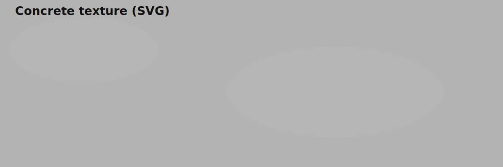
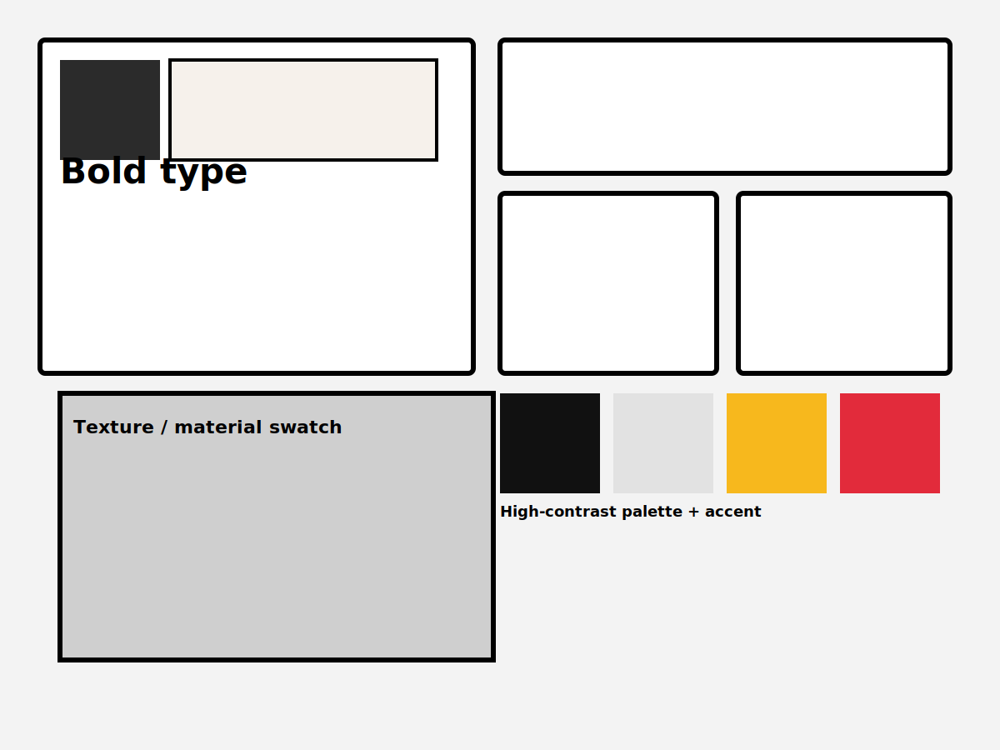

## What is Neobrutalism?

Neobrutalism (in UI and visual design) is a contemporary revival and reinterpretation of Brutalist principles applied to digital and graphic work. It emphasizes raw, unpolished aesthetics: stark contrasts, honest materials (or material-like textures), unapologetic grids, utilitarian layouts, and a focus on function over ornament.

The term is used loosely across web, product, and graphic design to describe work that intentionally rejects overly soft, skeuomorphic, or highly-polished UI trends in favor of a more direct, tactile, and occasionally abrasive look.

## Key characteristics

- Raw, exposed structure — visible frames, borders, and simple boxes
- High contrast color palettes and bold typography
- Limited ornamentation; emphasis on layout and function
- Uneven or hand-drawn accents (optional) to add human texture
- Use of concrete/metal-like textures or flat blocks that suggest materiality
- Deliberate use of imperfect details (misalignment, visible margins) to create personality

## Visual examples & images

Caption: A simple concrete-like texture for background and material studies.

Caption: Moodboard showing bold blocks, palettes, and typographic scales for neobrutalism-inspired UI.

## Notable (architectural) examples often cited as inspiration

- Barbican Centre, London
- Trellick Tower, London
- Boston City Hall, Boston
- National Theatre, London

These buildings show the sculptural, material-forward thinking that influences neobrutal visual language.

## References & further reading

- Wikipedia — Brutalism (good historical background): https://en.wikipedia.org/wiki/Brutalism
- Wikimedia Commons — Brutalist architecture category (images and media): https://commons.wikimedia.org/wiki/Category:Brutalist_architecture
- Unsplash — free photography useful for visual moodboards: https://unsplash.com/s/photos/brutalism

Suggested publication searches (to find longer essays and case studies): Dezeen, ArchDaily, Designboom, AIGA Eye on Design, and Medium design posts about "brutalism" or "neobrutalism".
